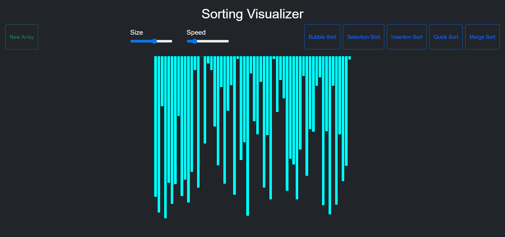

# Sorting_Visualizer
 Created a visualizer for various sorting algorithms.

### This is a simple visualization project made using javascript 
- Bubble Sort 
- Selection Sort
- Insertion Sort
- Quick Sort
- Merge Sort

### This is built using HTML, CSS, JavaScript  

[Check out the website here]( https://github.com/sonu2462/Sorting_Visualizer)

  
  
  

